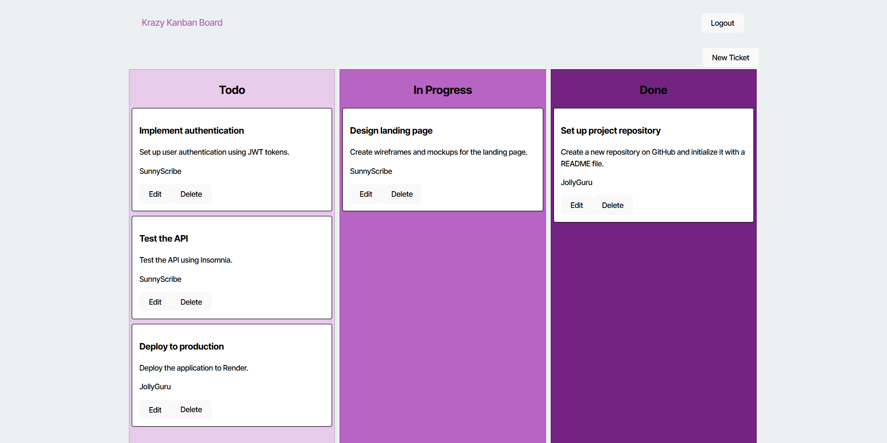
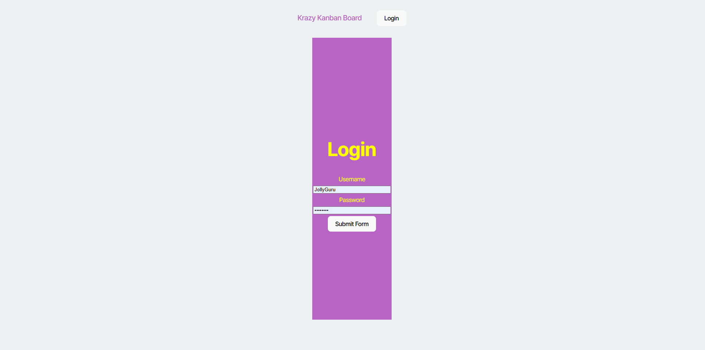

# Kanban Board 

## Description

This project involves enhancing an existing Kanban board application by integrating authentication using JSON Web Tokens (JWT). The goal is to create a secure login system that enables users to access and manage their tasks while ensuring their session is protected. This includes creating a functional login UI, updating the backend API for JWT authentication, and deploying the application to Render for live access.

### Key Features:
- Secure login with JWT-based authentication.
- Redirects for unauthorized users attempting to access protected pages.
- Deployment to Render for seamless access to the application.

## Table of Contents

- [Description](#description)
- [Installation](#installation)
- [Screenshots](#screenshots)
- [Usage](#usage)
- [Questions](#questions)

## Installation

1. Load the application in your browser.
2. Navigate to the login page.
3. Enter your username and password:
   -  This is the username and password I am using: { username: 'JollyGuru', password: 'password' },
   - Valid credentials will log you in and redirect to the Kanban board.
   - Invalid credentials will display an error message.
4. Use the Kanban board to manage your tasks.
5. Log out by clicking the logout button, which will remove your JWT and redirect you to the login page.

## Screenshots:

### Home page

### login page

### board page

## Usage

Render URL: https://kanban-board-dvcd.onrender.com/

GitHub Code: https://github.com/Bluzke/Kanban-Board

## Questions

Here is my Github profile: https://github.com/Bluzke

Here is my Email: Jsilber60@gmail.com